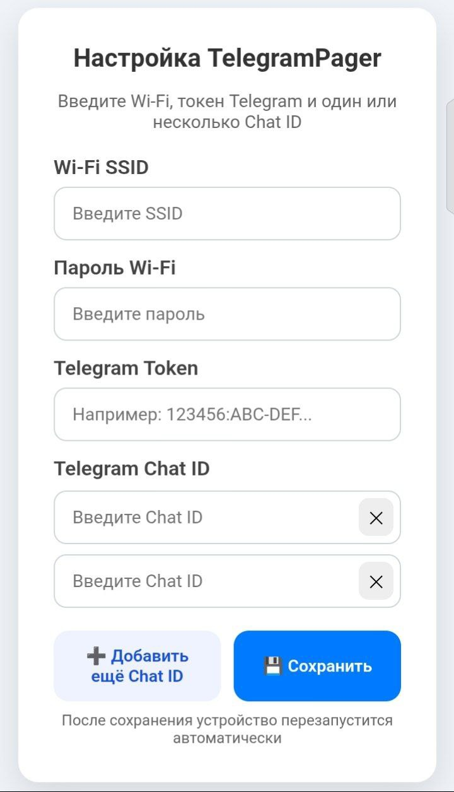
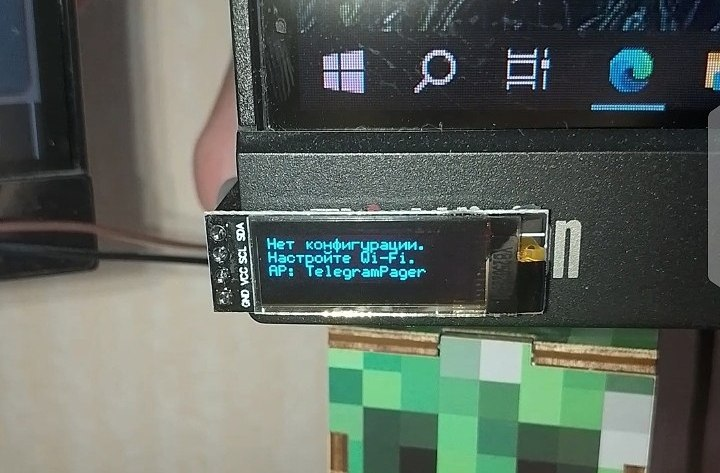
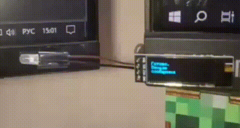
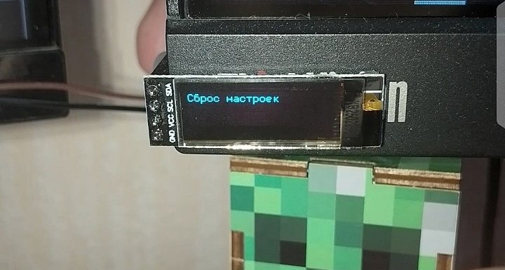

# 📟 TelegramPager

TelegramPager — это ESP8266-устройство с OLED-дисплеем, которое отображает сообщения из Telegram, получаемые через бот. Поддерживает прокрутку длинных сообщений с помощью кнопки и настройку через встроенный веб-интерфейс.

---

## ⚙ Особенности

- Получение сообщений из Telegram через бота.
- Прокрутка длинных сообщений на OLED 128x32.
- Кнопка для листания страниц сообщений.
- Встроенный веб-интерфейс для настройки Wi-Fi, Telegram Token и Chat ID.
- Автоматический сброс конфигурации и восстановление.
- Поддержка UTF-8 и кириллицы.

---

## 📌 Подключение

### Пины ESP8266 (NodeMCU)
| Функция             | Пин | Комментарий                  |
|--------------------|-----|------------------------------|
| LED                 | D5  | Индикатор                   |
| Кнопка сброса       | D3  | Сброс настроек              |
| Кнопка "Next"  | D4  | Пролистывание сообщений          |

---

## 🖥 Веб-интерфейс

Для настройки устройства используется встроенный веб-сервер. При первом запуске (или после сброса конфигурации) ESP8266 создаёт точку доступа `TelegramPager`.

### Настраиваемые параметры
- **Wi-Fi SSID**
- **Пароль Wi-Fi**
- **Telegram Token** (полученный у [BotFather](https://t.me/BotFather))
- **Chat ID** (можно добавить несколько)

  

После сохранения настроек устройство автоматически перезагружается.

---

## 📖 Использование

1. Загрузите скетч на ESP8266.
2. При первом запуске ESP8266 создаст Wi-Fi точку доступа для настройки.
3. Подключитесь к сети `TelegramPager` и откройте веб-интерфейс.

  

4. Введите Wi-Fi данные, Telegram Token и Chat ID.
5. После подключения к Wi-Fi устройство начнет отображать новые сообщения на OLED-дисплее.
6. Для просмотра следующей страницы сообщения используйте кнопку `Next`.

  

---

## 💡 Принцип работы

- Сообщения Telegram проверяются через бот с периодом `BOT_MTBS = 1000 ms`.
- OLED отображает 3 строки текста одновременно (`MAX_LINES_PER_PAGE = 3`).
- Длинные сообщения автоматически разбиваются на страницы.
- Кнопка листания `BTN_NEXT` имеет антидребезговую защиту.
- Сброс настроек осуществляется кнопкой `BTN_RESET`.

  

---

## 🛠 Установка

1. Установите библиотеки:
   - `ESP8266WiFi`
   - `ESP8266WiFiMulti`
   - `WiFiClientSecure`
   - `ESP8266WebServer`
   - `FS`
   - `UniversalTelegramBot`
   - `ArduinoJson`
   - `U8g2lib`
2. Подключите OLED-дисплей и кнопки к ESP8266.
3. Загрузите скетч tgbot.ino через Arduino IDE или PlatformIO.

---

## 🔧 Настройки

- Файл конфигурации хранится в SPIFFS: `/config.txt`
